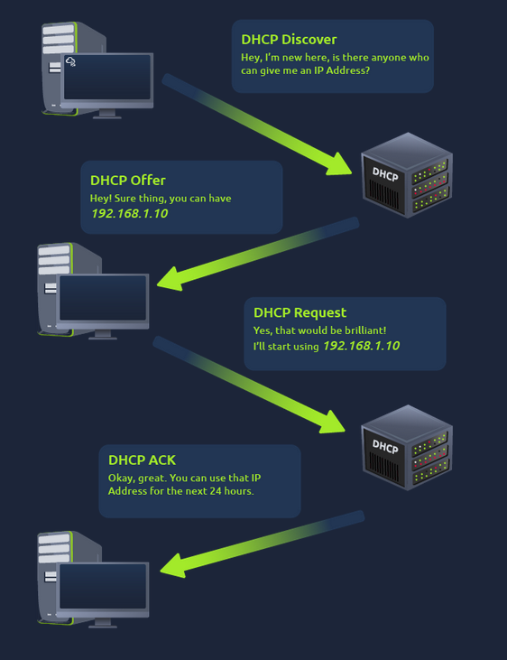

What is Networking?
====================
https://tryhackme.com/room/whatisnetworking
MAC
However, an interesting thing with MAC addresses is that they can be faked or "spoofed" in a process known as spoofing. This spoofing occurs when a networked device pretends to identify as another using its MAC address. When this occurs, it can often break poorly implemented security designs that assume that devices talking on a network are trustworthy. Take the following scenario: A firewall is configured to allow any communication going to and from the MAC address of the administrator. If a device were to pretend or "spoof" this MAC address, the firewall would now think that it is receiving communication from the administrator when it isn't.

ping
Ping uses ICMP (Internet Control Message Protocol) packets to determine the performance of a connection between devices, for example, if the connection exists or is reliable.

Intro to LAN
=============
https://tryhackme.com/room/introtolan

As we can recall, an IP address is made up of four sections called octets. The same goes for a subnet mask which is also represented as a number of four bytes (32 bits), ranging from 0 to
255 (0-255).

Subnets use IP addresses in three different ways:

- Identify the network address
- Identify the host address
- Identify the default gateway

Let's split these three up to understand their purposes into the table below:

| Type            | Purpose                                                                                                                                        | Explanation                                                                                                                                                                                                                                          | Example       |
| :-------------- |:---------------------------------------------------------------------------------------------------------------------------------------------- | :----------------------------------------------------------------------------------------------------------------------------------------------------------------------------------------------------------------------------------------------------|:--------------|
| Network Address | Identifies the start of the actual network and is used to identify a network's existence.                                                      | For example, a device with the IP address of 192.168.1.100 will be on the network identified by 192.168.1.0.                                                                                                                                         | 192.168.1.0   |
| Host Address    | An IP address here is used to identify a device on the subnet                                                                                  | For example, a device will have the network address of 192.168.1.1                                                                                                                                                                                   | 192.168.1.100 |
| Default Gateway | The default gateway address is a special address assigned to a device on the network that is capable of sending information to another network | Any data that needs to go to a device that isn't on the same network (i.e. isn't on 192.168.1.0) will be sent to this device. These devices can use any host address but usually use either the first or last host address in a network (.1 or .254) | 192.168.1.254 |

ARP
====

Recalling from our previous tasks that devices can have two identifiers: A MAC address and an IP address, the Address Resolution Protocol or ARP for short, 
is the technology that is responsible for allowing devices to identify themselves on a network.
Simply, ARP allows a device to associate its MAC address with an IP address on the network. Each device on a network will keep a log of the MAC addresses associated with other devices.

Each device within a network has a ledger to store information on, which is called a cache. In the context of ARP, this cache stores the identifiers of other devices on the network.
In order to map these two identifiers together (IP address and MAC address), ARP sends two types of messages:
- ARP Request
- ARP Reply

DHCP
=====
IP addresses can be assigned either manually, by entering them physically into a device, or automatically and most commonly by using a DHCP (Dynamic Host Configuration Protocol) server. 
When a device connects to a network, if it has not already been manually assigned an IP address, it sends out a request (DHCP Discover) to see if any DHCP servers are on the network. 
The DHCP server then replies back with an IP address the device could use (DHCP Offer). The device then sends a reply confirming it wants the offered IP Address (DHCP Request), and then lastly, 
the DHCP server sends a reply acknowledging this has been completed, and the device can start using the IP Address (DHCP ACK).

